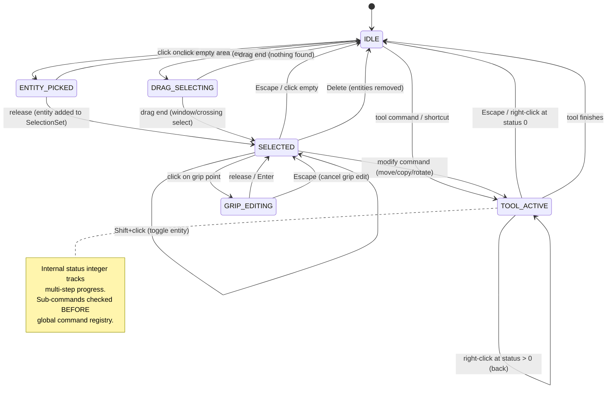

# 33 — Input State Machine Architecture

This document defines the unified input dispatch architecture for NEXUS CAD. It replaces the fragmented input handling currently spread across `+page.svelte`, `ToolMachine.svelte.ts`, `CommandLine.svelte`, and individual tool classes. The design is derived from deep analysis of LibreCAD's `RS_ActionInterface` / `LC_EventHandler` system and Blender's `wmOperatorType` / `wm_event_system.cc` operator pipeline.

---

## 1. Research Summary

### 1A. LibreCAD Patterns

**State Machine Lifecycle.** Every tool inherits from `RS_ActionInterface`, which owns an integer `m_status` field. Status 0 is initial, negative is finished. Each tool defines its own enum (e.g., `SetStartpoint = 0`, `SetEndpoint = 1`). The base class dispatches all events with the current status passed in: `onMouseLeftButtonRelease(status, event)`, `onCoordinateEvent(status, isZero, pos)`, `doProcessCommand(status, command)`. This means a single tool class contains its entire state machine in switch statements on `status`.

**Coordinate Event Abstraction.** `fireCoordinateEvent(RS_Vector)` is the critical unifier. When the user clicks, `onMouseLeftButtonRelease` computes the snap-resolved world coordinate, then calls `fireCoordinateEvent(coord)`. When the user types `10,20` in the command line, `LC_EventHandler::commandEvent()` parses it via `LC_CoordinatesParser` and calls `coordinateEvent()` on the current action. Either way, the tool receives `onCoordinateEvent(status, isZero, pos)`. The tool never knows or cares about the input source.

**Command Dispatch Priority.** In `LC_EventHandler::commandEvent()`:
1. Parse as coordinate. If valid, send `coordinateEvent()` to the current action. **Accept. Stop.**
2. Otherwise, send `commandEvent()` to the current action. The action's `doProcessCommand(status, cmd)` checks against its `getAvailableCommands()` list. If the action accepts it, **stop**.
3. If the action did NOT accept it, the event propagates to global command resolution (`RS_Commands::cmdToAction()`), which maps the string to an `ActionType` and potentially launches a new action.

This three-level dispatch (coordinate → tool sub-command → global command) is the core pattern that solves bugs #1, #2, and #12.

**Predecessor / Tool Stacking.** When a new action is set while another is running, the running action is suspended (not destroyed), and the new action gets a `predecessor` pointer. When the new action finishes, the predecessor is resumed. This allows temporary tool switches (e.g., launching a zoom action during line drawing).

**Context-Sensitive Commands.** `getAvailableCommands()` returns different strings depending on the current status. For `RS_ActionDrawLine` at `SetEndpoint` status with 2+ points: `["close", "undo"]`. At `SetStartpoint`: `[]`. These are also shown in the UI prompt.

**Mouse Widget Hints.** Every `setStatus()` call triggers `updateMouseButtonHints()`, which each tool overrides to set left/right button descriptions (e.g., "Specify next point or [Close/Undo]" / "Back").

### 1B. Blender Patterns

**exec / invoke / modal Trichotomy.** Every `wmOperatorType` has three optional callbacks:
- `exec(C, op)` — Non-interactive. Called by scripts, repeat-last, AI. No events, no modal state.
- `invoke(C, op, event)` — Starts interactive mode. May immediately finish (for simple ops) or return `OPERATOR_RUNNING_MODAL` to enter modal state.
- `modal(C, op, event)` — Called for every subsequent event while the operator is modal. Must return `RUNNING_MODAL` to stay active, `FINISHED` or `CANCELLED` to end.

This maps directly to NEXUS's `execute(params)` vs `invoke()` split in `CommandDef`.

**PASS_THROUGH.** A modal operator can return `OPERATOR_PASS_THROUGH` for events it doesn't handle (e.g., mouse wheel during a transform). The event system then continues dispatching to lower-priority handlers (viewport navigation). This allows zoom/pan to work during any tool.

**poll().** Before an operator runs, `poll(C)` checks preconditions (e.g., "is there an active object?"). Failed polls are silent — the operator simply isn't available.

**Priority Chain.** In `wm_event_do_handlers()`:
1. **Modal handlers** (`win.runtime->modalhandlers`) — highest priority
2. **Drag-and-drop** test
3. If not handled by modal: **Area regions** → **Area handlers** → next area
4. Within each level: handlers are iterated; `WM_HANDLER_BREAK` stops propagation

### 1C. Current NEXUS Problems

The current architecture has three independent input paths that don't coordinate:

1. **`handleKeydown()` in `+page.svelte`** — A giant if/else chain that checks `app.tools.handleKeyDown(e)` first (good), but then has hardcoded single-letter shortcuts (`e.key === 'c'` → circle) that always fire regardless of active tool context. This is why `C` during line triggers Circle instead of Close.

2. **`handleCommand()` in `+page.svelte`** — Tries `app.tools.handleCommandInput(trimmed)` first (good for coordinates), then falls through to `commandRegistry.resolve(lower)` and `toolRegistry.has(lower)`. But `handleCommandInput` on `LineTool` only handles coordinate parsing — it never handles sub-commands like "close" or "undo".

3. **`CommandLine.svelte` auto-focus** — When a non-select tool is active, alphanumeric keypresses get forwarded to the command line via `cmdLine?.focusWithKey(e.key)`. This means typing `c` during line tool focuses the command line and starts matching against global commands instead of being intercepted as a tool sub-command.

4. **Selection state split** — `SelectionState.svelte.ts` wraps `SelectionManager` in the renderer, but drag-select in `SelectTool` reports count without committing to `SelectionState`. The renderer's `SelectionManager.selectedIds` and `SelectionState.selectedIds` can diverge.

5. **No unified status/prompt** — Each tool independently returns `getStatusText()`, but there's no reactive connection between tool state transitions and prompt updates. The command line derives its prompt from `activeToolId` + `statusText`, but `statusText` is set manually after each dispatch.

---

## 2. State Diagram

```
                                      ┌─────────────────────────────────┐
                                      │                                 │
                    ┌─────────────────▼──────────────────┐              │
                    │              IDLE                   │              │
                    │  (select tool active, no selection) │              │
                    └───┬──────┬──────┬──────┬───────────┘              │
                        │      │      │      │                          │
              click on  │   drag│  cmd │  key │                         │
              entity    │  start│ line │ shortcut                       │
                        ▼      ▼      ▼      ▼                         │
            ┌───────────────┐ ┌────────┐ ┌──────────────┐              │
            │  ENTITY_PICKED│ │DRAGGING│ │ TOOL_ACTIVE  │◄─── Esc ────┤
            │  (pre-select) │ │_SELECT │ │ (modal tool) │              │
            └──────┬────────┘ └───┬────┘ └──┬───────────┘              │
                   │              │         │                          │
                   ▼              ▼         │  coord/sub-cmd/          │
            ┌──────────────┐  ┌──────────┐ │  mouse click             │
            │  SELECTED    │  │SELECTED  │ │         │                 │
            │  (1+ entity) │  │(N entity)│ ▼         │                 │
            └──┬───┬───────┘  └──┬───────┘ ┌─────────▼────────┐       │
               │   │             │         │  TOOL_ACTIVE      │       │
          grip │   │ Delete/     │         │  status=N         │       │
          hit  │   │ modify      │         │  (awaiting next   │       │
               │   │ cmd         │         │   input point)    │       │
               ▼   ▼             │         └──────┬────────────┘       │
         ┌──────────┐  ┌────────▼───┐             │                   │
         │GRIP_EDIT │  │MODIFY_TOOL │         trigger()                │
         │(dragging │  │(move/copy/ │         (entity created)         │
         │ grip pt) │  │ rotate...) │             │                    │
         └────┬─────┘  └──────┬─────┘             │ tool may loop     │
              │               │                   │ (line chains)      │
              │ release       │ finish/esc         │ or finish          │
              ▼               ▼                   ▼                    │
              └───────────────┴───────────────────┘                    │
                              │                                        │
                              │  Escape / finish                       │
                              └────────────────────────────────────────┘
```

### Mermaid State Diagram



---

## 3. InputStateMachine Class Design

```typescript
type InputMode = 'IDLE' | 'TOOL_ACTIVE' | 'SELECTED' | 'DRAG_SELECTING' | 'GRIP_EDITING';

interface InputStateMachine {
  // --- Reactive state (Svelte 5 $state) ---
  readonly mode: InputMode;
  readonly activeToolId: string | null;
  readonly activeHandler: ToolHandler | null;
  readonly prompt: string;               // "Specify first point:" or "Command:"
  readonly mouseHints: MouseHints;       // { left: "First point", right: "Cancel" }
  readonly availableCommands: string[];  // context-sensitive sub-commands
  readonly statusMessage: string;        // informational messages

  // --- Selection (authoritative) ---
  readonly selection: SelectionSet;

  // --- The single entry point ---
  handleInput(event: InputEvent): void;

  // --- Tool lifecycle ---
  setTool(id: string): void;
  cancelCurrentTool(): void;

  // --- For external callers (MCP/AI agents) ---
  executeCommand(id: string, params: Record<string, unknown>): CommandResult;
}
```

### Construction

```typescript
interface InputStateMachineConfig {
  commandRegistry: CommandRegistry;
  kernel: KernelBridge;
  renderer: CadRenderer;
  onStatusChange?: (status: StatusUpdate) => void;
}

function createInputStateMachine(config: InputStateMachineConfig): InputStateMachine;
```

---

## 4. Unified InputEvent Type

Every input — mouse click, keyboard press, command line submission, coordinate entry — is normalized into a single `InputEvent` discriminated union before entering `handleInput()`.

```typescript
type InputEvent =
  | { type: 'POINTER_DOWN'; point: Vec2; worldX: number; worldY: number; button: 'left' | 'right' | 'middle'; shiftKey: boolean; ctrlKey: boolean; raw: PointerEvent }
  | { type: 'POINTER_MOVE'; point: Vec2; worldX: number; worldY: number; raw: PointerEvent }
  | { type: 'POINTER_UP'; point: Vec2; worldX: number; worldY: number; button: 'left' | 'right' | 'middle'; raw: PointerEvent }
  | { type: 'DRAG_START'; point: Vec2; worldX: number; worldY: number }
  | { type: 'DRAG_MOVE'; point: Vec2; worldX: number; worldY: number }
  | { type: 'DRAG_END'; start: Vec2; end: Vec2 }
  | { type: 'KEY_DOWN'; key: string; code: string; ctrlKey: boolean; shiftKey: boolean; altKey: boolean; metaKey: boolean; raw: KeyboardEvent }
  | { type: 'KEY_UP'; key: string; code: string; raw: KeyboardEvent }
  | { type: 'COMMAND_TEXT'; text: string }           // from command line submit
  | { type: 'COORDINATE'; point: Vec2 }             // parsed coordinate (typed or API)
  | { type: 'WHEEL'; deltaY: number; worldX: number; worldY: number; raw: WheelEvent };

interface Vec2 {
  x: number;
  y: number;
}
```

### Event Normalization

The Svelte `+page.svelte` template and `Workspace.svelte` will translate raw DOM events into `InputEvent` objects and call `handleInput()`. This translation layer is thin and does not contain any dispatch logic.

```typescript
// In Workspace.svelte — translates DOM events
function onPointerDown(e: PointerEvent) {
  const world = renderer.screenToWorld(e.clientX, e.clientY);
  const snapped = snapEngine.resolve(world.x, world.y);
  inputMachine.handleInput({
    type: 'POINTER_DOWN',
    point: snapped,
    worldX: world.x,
    worldY: world.y,
    button: e.button === 0 ? 'left' : e.button === 2 ? 'right' : 'middle',
    shiftKey: e.shiftKey,
    ctrlKey: e.ctrlKey || e.metaKey,
    raw: e,
  });
}

// In CommandLine.svelte — translates text submit
function onSubmit(text: string) {
  const coord = parseCoordinate(text, lastPoint);
  if (coord) {
    inputMachine.handleInput({ type: 'COORDINATE', point: coord });
  } else {
    inputMachine.handleInput({ type: 'COMMAND_TEXT', text });
  }
}
```

---

## 5. ToolHandler Interface

This replaces both the current `BaseTool` abstract class and the `ToolHandler` interface. A single interface that every interactive tool implements.

```typescript
interface ToolHandler {
  readonly id: string;
  readonly status: number;                    // LibreCAD-style integer status

  // --- Lifecycle ---
  activate(): void;                           // called when tool becomes active
  deactivate(): void;                         // called when tool is replaced or cancelled
  suspend(): void;                            // called when a temporary tool overlays (zoom)
  resume(): void;                             // called when temporary tool finishes

  // --- Input handlers ---
  /** Receives snap-resolved coordinates from either mouse click or typed input.
   *  This is the primary input method for geometry tools. */
  onCoordinateInput(status: number, point: Vec2): void;

  /** Receives sub-commands like "close", "undo", "radius".
   *  Returns true if the command was handled (prevents global dispatch). */
  onCommandInput(status: number, command: string): boolean;

  /** Receives keyboard events.
   *  Returns 'HANDLED' to stop propagation, 'PASS_THROUGH' to continue. */
  onKeyDown(status: number, key: string, event: KeyboardEvent): HandleResult;

  /** Receives pointer move for preview/rubber-band updates. */
  onPointerMove(status: number, point: Vec2, worldX: number, worldY: number): void;

  /** Receives right-click. Default: go back one status or cancel. */
  onRightClick(status: number): void;

  // --- Context queries ---
  /** Returns sub-commands available at the current status.
   *  Used for: (a) command priority resolution, (b) tab completion,
   *  (c) prompt display "[Close/Undo]". */
  getAvailableCommands(): string[];

  /** Returns the prompt for the current status (e.g., "Specify next point:"). */
  getPrompt(): string;

  /** Returns mouse button hint text. */
  getMouseHints(): MouseHints;

  /** Returns the last accepted point (for relative coordinate calculation). */
  getLastPoint(): Vec2 | null;

  /** Returns preview geometry for the renderer. */
  getPreviewGeometry?(): PreviewEntity[];
}

type HandleResult = 'HANDLED' | 'PASS_THROUGH';

interface MouseHints {
  left: string;
  right: string;
}

interface PreviewEntity {
  type: 'line' | 'circle' | 'arc' | 'rectangle' | 'polyline';
  data: Record<string, unknown>;
}
```

### Default Behaviors (via base class or mixin)

```typescript
abstract class BaseToolHandler implements ToolHandler {
  abstract readonly id: string;
  protected _status = 0;
  protected points: Vec2[] = [];
  protected ctx!: ToolContext;

  get status() { return this._status; }

  activate(): void { this._status = 0; this.points = []; }
  deactivate(): void { this.ctx.renderer?.clearPreview(); }
  suspend(): void {}
  resume(): void {}

  /** Default right-click: status > 0 → go back; status 0 → cancel. */
  onRightClick(status: number): void {
    if (status > 0) {
      this._status = status - 1;
    } else {
      this.ctx.machine.cancelCurrentTool();
    }
  }

  onKeyDown(_status: number, _key: string, _event: KeyboardEvent): HandleResult {
    return 'PASS_THROUGH';
  }

  onCommandInput(_status: number, _command: string): boolean {
    return false;
  }

  getAvailableCommands(): string[] { return []; }
  getLastPoint(): Vec2 | null {
    return this.points.length > 0 ? this.points[this.points.length - 1] : null;
  }
  getPreviewGeometry(): PreviewEntity[] { return []; }
}
```

### Example: LineToolHandler

```typescript
// Pseudocode — illustrates the pattern, not implementation
class LineToolHandler extends BaseToolHandler {
  readonly id = 'line';
  private startOffset = 0;

  // Status enum
  static SetStartpoint = 0;
  static SetEndpoint = 1;

  onCoordinateInput(status: number, point: Vec2): void {
    switch (status) {
      case LineToolHandler.SetStartpoint:
        this.points = [point];
        this.startOffset = 0;
        this._status = LineToolHandler.SetEndpoint;
        break;
      case LineToolHandler.SetEndpoint:
        // Create line entity via command system
        this.ctx.executeCommand({
          type: 'CreateLine',
          x1: this.points[0].x, y1: this.points[0].y,
          x2: point.x, y2: point.y,
          layer_id: this.ctx.activeLayerId,
        });
        this.points = [point]; // chain
        this.startOffset++;
        break;
    }
  }

  onCommandInput(status: number, command: string): boolean {
    if (command === 'close' && status === 1 && this.startOffset >= 2) {
      this.close();
      return true;
    }
    if (command === 'undo' && status === 1) {
      this.undo();
      return true;
    }
    return false;
  }

  getAvailableCommands(): string[] {
    const cmds: string[] = [];
    if (this._status === 1) {
      if (this.startOffset >= 2) cmds.push('close');
      cmds.push('undo');
    }
    return cmds;
  }

  getPrompt(): string {
    return this._status === 0
      ? 'LINE Specify first point:'
      : `Specify next point or [${this.getAvailableCommands().join('/')}]:`;
  }

  getMouseHints(): MouseHints {
    return this._status === 0
      ? { left: 'First point', right: 'Cancel' }
      : { left: 'Next point', right: 'Back' };
  }
}
```

---

## 6. SelectionSet Design

A single authoritative selection store. The renderer's `SelectionManager` becomes a visual-only system that reads from this store.

```typescript
interface SelectionSet {
  // --- Reactive state ---
  readonly selectedIds: ReadonlySet<string>;
  readonly preselectedId: string | null;      // hover highlight
  readonly count: number;                     // derived

  // --- Mutation ---
  select(id: string): void;
  deselect(id: string): void;
  toggle(id: string): void;
  selectMultiple(ids: string[]): void;
  replaceWith(ids: string[]): void;           // clear + select all
  clear(): void;

  // --- Preselection (hover) ---
  setPreselect(id: string | null): void;

  // --- Selection gate (FreeCAD pattern) ---
  installGate(gate: SelectionGate): void;
  removeGate(): void;

  // --- Query ---
  has(id: string): boolean;
  getIds(): string[];
  isEmpty(): boolean;

  // --- Bulk operations ---
  selectAll(): void;                          // all entities in current view
  selectByRect(
    x1: number, y1: number, x2: number, y2: number,
    mode: 'window' | 'crossing'
  ): void;
}

interface SelectionGate {
  canSelect(entityId: string): boolean;
  reason: string;                             // "Select a line or arc to trim"
}
```

### Data flow

```
SelectionSet ($state)
    │
    ├──▶ renderer.selectionManager.syncFrom(selectedIds)  // visual update
    ├──▶ propertiesPanel reads selectedIds                 // property display
    ├──▶ statusBar reads count                             // "3 entities selected"
    └──▶ tools read selectedIds                            // modify tools operate on these
```

The renderer's `SelectionManager` no longer owns selection state. It receives the set of selected IDs and manages only the visual representation (highlight meshes, grip point rendering).

---

## 7. Priority Resolution

The `handleInput()` method follows a strict priority chain, modeled after LibreCAD's `LC_EventHandler::commandEvent()` and Blender's `wm_event_do_handlers()`.

### For COMMAND_TEXT events

```
1. Parse as coordinate
   → If valid: send to activeHandler.onCoordinateInput(status, point)
   → STOP

2. Send to activeHandler.onCommandInput(status, text)
   → If handler returns true: STOP
   → (This is where "close" during line gets caught)

3. Resolve via CommandRegistry
   → If found and is invoke-type: cancel current tool, set new tool
   → If found and is execute-type: execute immediately
   → STOP

4. Unknown command → set statusMessage = "Unknown: ..."
```

### For KEY_DOWN events

```
1. Check modifier combos (Ctrl+Z, Ctrl+C, etc.)
   → These are ALWAYS global, never intercepted by tools
   → STOP if matched

2. If mode === TOOL_ACTIVE:
   a. Send to activeHandler.onKeyDown(status, key, event)
      → If returns 'HANDLED': STOP
   b. Check if key matches any available sub-command alias
      (e.g., 'c' matches 'close' if 'close' in getAvailableCommands())
      → If matched: send as onCommandInput(status, 'close')
      → STOP if handled

3. Check single-key tool shortcuts (only if NO tool is active or tool didn't handle)
   → 'l' → line, 'c' → circle, etc.
   → STOP if matched

4. Pass to command line focus (forward key)
```

### For POINTER_DOWN (left) events

```
1. If mode === TOOL_ACTIVE:
   → Snap-resolve point
   → Send to activeHandler.onCoordinateInput(status, point)
   → STOP

2. If mode === IDLE or SELECTED:
   → Hit-test at click position
   → If entity hit: toggle selection (with shift) or replace selection
   → If no hit: clear selection, begin DRAG_SELECTING

3. If mode === SELECTED and grip hit:
   → Enter GRIP_EDITING mode
```

### For POINTER_DOWN (right) events

```
1. If mode === TOOL_ACTIVE:
   → activeHandler.onRightClick(status)
   → If status was 0: cancel tool → IDLE
   → If status > 0: go back one step (LibreCAD "Back" pattern)
   → STOP

2. If mode === IDLE or SELECTED:
   → Show context menu
```

### For WHEEL events

```
ALWAYS pass through to renderer zoom, regardless of mode.
(Blender PASS_THROUGH pattern — zoom/pan never blocked)
```

---

## 8. Pass-Through Events

Following Blender's `OPERATOR_PASS_THROUGH` pattern, certain events always reach the viewport navigation layer, regardless of the current mode.

### Always pass-through (never blocked by tool or mode)

| Event | Action |
|-------|--------|
| `WHEEL` | Zoom in/out |
| `POINTER_MOVE` with middle button held | Pan |
| `POINTER_DOWN` middle button | Begin pan |
| `KEY_DOWN` with `+`/`-`/`Home`/`F2` | Zoom shortcuts |
| `KEY_DOWN` with `F3`/`F7`/`F8`/`F9`/`F12` | Toggle snap/grid/ortho |

### Implementation

```typescript
function handleInput(event: InputEvent): void {
  // Step 0: Pass-through events (always handled, never blocked)
  if (isPassThroughEvent(event)) {
    handlePassThrough(event);
    // Do NOT return — some pass-through events also feed the tool
    // (e.g., POINTER_MOVE updates both viewport cursor AND tool preview)
  }

  // Step 1-4: Priority chain (see section 7)
  // ...
}

function isPassThroughEvent(event: InputEvent): boolean {
  if (event.type === 'WHEEL') return true;
  if (event.type === 'POINTER_DOWN' && event.button === 'middle') return true;
  if (event.type === 'KEY_DOWN') {
    const passKeys = new Set(['+', '-', '=', 'Home', 'F2', 'F3', 'F7', 'F8', 'F9', 'F12']);
    if (passKeys.has(event.key)) return true;
  }
  return false;
}
```

---

## 9. Status / Prompt Feedback

The state machine exposes reactive state that the UI observes. No manual `statusText` assignments scattered through the codebase.

```typescript
// These are $state properties on InputStateMachine

/** The current prompt shown in the command line input row. */
readonly prompt: string;
// Derived from: mode + activeHandler?.getPrompt() + selection state
// IDLE → "Command:"
// TOOL_ACTIVE → activeHandler.getPrompt()  (e.g., "LINE Specify next point or [Close/Undo]:")
// SELECTED → "Command:" (with selection count in status bar)

/** Mouse button hints shown in status bar. */
readonly mouseHints: MouseHints;
// Derived from: mode + activeHandler?.getMouseHints()
// IDLE → { left: "Select", right: "Context menu" }
// TOOL_ACTIVE → activeHandler.getMouseHints()
// SELECTED → { left: "Select more", right: "Context menu" }

/** Available sub-commands for tab completion and prompt display. */
readonly availableCommands: string[];
// Derived from: activeHandler?.getAvailableCommands() ?? []

/** Informational messages (transient). */
readonly statusMessage: string;
// Set by: command execution results, error messages, tool feedback
```

### Update Flow

```
Tool status change
    → _status modified in handler
    → InputStateMachine detects via $effect or direct call
    → prompt, mouseHints, availableCommands recomputed ($derived)
    → CommandLine.svelte, StatusBar.svelte react automatically
```

The command line component reads `availableCommands` for:
- Tab completion filtering (tool sub-commands appear before global commands)
- Prompt text rendering (extracting `[Close/Undo]` from prompt string)
- Auto-complete suggestions

---

## 10. Bug Resolution Table

| # | Bug | Root Cause | Resolution |
|---|-----|-----------|------------|
| 1 | `C` during line → Circle instead of Close | `handleKeydown()` in `+page.svelte` has `else if (e.key === 'c') app.tools.setTool('circle')` with no tool-priority check | Priority chain (Section 7): KEY_DOWN goes to activeHandler first. Handler's `getAvailableCommands()` includes "close"; single-key `c` matches "close" prefix → dispatched as sub-command, never reaches global shortcuts. |
| 2 | `R` during array → Redo instead of Rectangular | Same pattern: global keybindings checked before tool sub-commands | Same fix: tool sub-commands checked first. Array tool returns `['rectangular', 'polar']` from `getAvailableCommands()`, `r` matches "rectangular". |
| 3 | Drag box selection reports count but doesn't commit | `SelectTool.onDragEnd` likely calls renderer's `selectByRect()` but doesn't update the app-level `SelectionState` | `SelectionSet` is the single authority (Section 6). `DRAG_END` → `selection.replaceWith(hitIds)` → renderer syncs from SelectionSet. One path, one state. |
| 4 | Delete after drag select deletes 0 | `app.deleteSelected()` reads from `selection.getSelectedIds()` which may read stale renderer state | `deleteSelected()` reads from `SelectionSet.getIds()`, which is always current because drag-select commits to SelectionSet (see #3 fix). |
| 5 | Escape doesn't reset command line | `handleKeydown` sets tool to 'select' but doesn't clear the command line text | `handleInput({ type: 'KEY_DOWN', key: 'Escape' })` → state machine transitions to IDLE → `prompt` reactive property updates to "Command:" → command line reacts. Additionally, `cancelCurrentTool()` explicitly signals command line reset. |
| 6 | Ctrl+A select all not working | Context menu's `onSelectAll` has `/* TODO */` comment; no keyboard handler | Add `Ctrl+A` to global modifier combos (Step 1 of KEY_DOWN priority). Handler calls `selection.selectAll()` which queries kernel for all entity IDs. |
| 7 | Layer visibility toggle not wired to renderer | Layer panel toggles state but renderer doesn't re-query visibility | Outside InputStateMachine scope (this is a rendering/sync issue), but the fix is: layer visibility changes emit an event → `syncView()` re-reads layer visibility → renderer filters by visible layers. Included here as it needs the event bus that the state machine encourages. |
| 8 | Properties panel geometry values read-only | Properties panel displays but doesn't have edit handlers | Outside InputStateMachine scope (property editing is a command issue), but the architecture enables it: property edit → `executeCommand({ type: 'ModifyEntity', id, changes })` → event sourced → renderer syncs. |
| 9 | Extend tool doesn't work | Tool likely has broken status transitions | The `ToolHandler` interface enforces proper status-driven dispatch. Each tool's `onCoordinateInput(status, point)` handles its own status transitions. The `ExtendToolHandler` would follow the same pattern as `LineToolHandler` with proper status enum and transitions. |
| 10 | Arc tool shows circle preview | `ArcTool.onPointerMove` probably renders a circle instead of an arc during intermediate states | Tool now has proper status-driven `getPreviewGeometry()`. At `SetEndAngle` status, preview returns arc geometry computed from center + radius + start angle + current mouse angle, not a full circle. |
| 11 | Status toggles (OSNAP, SNAP, ORTHO) default OFF | State initialization doesn't set defaults to ON | `InputStateMachineConfig` initializes snap/ortho/grid state. The toggles are pass-through events (Section 8) that always work regardless of mode. Default values set during construction: `snapEnabled = true`, `orthoMode = false`, `gridSnapEnabled = true`. |
| 12 | Auto-focus command line intercepts tool sub-commands | `handleKeydown` forwards alphanumeric to `cmdLine?.focusWithKey()` when a tool is active, bypassing tool dispatch | Eliminated entirely. The `handleInput` priority chain (Section 7, KEY_DOWN step 2) sends single keys to the active tool first. Only if the tool returns `PASS_THROUGH` AND the key doesn't match any sub-command does it reach the command line. The command line never auto-focuses — it only receives `COMMAND_TEXT` events from explicit Enter-submit. |
| 13 | Move tool repeats "Specify base point" without progress | `MoveTool` likely doesn't advance its status after receiving the first point | `MoveToolHandler.onCoordinateInput(status, point)` properly transitions: status 0 (base point) → stores point, sets status = 1 → status 1 (destination) → executes `MoveEntity` command for all selected entities, finishes. The status integer guarantees progression. |

---

## 11. Extension Points

### Adding a New Tool (any domain)

To add a new tool (e.g., BIM wall placement, GIS feature creation):

1. **Implement `ToolHandler`** — Define status enum, implement `onCoordinateInput`, `onCommandInput`, `getAvailableCommands`, `getPrompt`, `getMouseHints`.
2. **Register as `CommandDef`** — Add to `CommandRegistry` with `id`, `aliases`, `invoke()` factory, and `execute(params)` for non-interactive use.
3. **Define MCP tool schema** — JSON Schema for parameters (automatically derived from `CommandDef.schema`).

No changes to `InputStateMachine`, `+page.svelte`, `CommandLine.svelte`, or any other infrastructure code.

### Adding a New Input Mode

To add a new top-level mode (e.g., `ANNOTATION_EDITING`, `CONSTRAINT_DRAGGING`):

1. Add to the `InputMode` union type.
2. Add transitions in the state diagram.
3. Add handling in `handleInput()` for the new mode.

This is rare — most new functionality fits within `TOOL_ACTIVE` via new `ToolHandler` implementations.

### Adding a New Event Type

To add a new input source (e.g., tablet pressure, NDOF controller, VR controller):

1. Add a variant to the `InputEvent` union.
2. Add a pass-through rule if needed (Section 8).
3. Add handling in `handleInput()` or pass to active tool.

### Domain-Specific Selection Gates

BIM, GIS, and Civil tools can install `SelectionGate` filters:

```typescript
// During "Assign Material" BIM tool
selection.installGate({
  canSelect: (id) => kernel.hasComponent(id, 'BIMProperties'),
  reason: 'Select a BIM element to assign material',
});
```

### 3D Mode Extension

When 3D rendering is added:
- `Vec2` extends to `Vec3` in coordinate events
- `InputEvent` gains `POINTER_DOWN_3D` variants with ray information
- `ToolHandler.onCoordinateInput` receives `Vec2 | Vec3`
- The priority chain and mode system remain identical

### AI Agent Integration

AI agents bypass the input event system entirely and call `executeCommand()` directly:

```typescript
// MCP tool call from AI agent
const result = inputMachine.executeCommand('draw_line', {
  x1: 0, y1: 0, x2: 100, y2: 50, layer_id: 'layer_0'
});
```

This follows the existing `CommandDef.execute(params)` path, which goes through the kernel command system, event sourcing, and renderer sync — identical to human use.

---

## Appendix A: Migration Path

### Phase 1: Core Types
Define `InputEvent`, `ToolHandler`, `SelectionSet`, `InputStateMachine` interfaces in `@nexus/core` or `packages/app/src/lib/input/`.

### Phase 2: SelectionSet
Replace dual `SelectionState` + `SelectionManager.selectedIds` with single `SelectionSet`. Renderer reads from it. Fixes bugs #3, #4, #6.

### Phase 3: InputStateMachine Shell
Create `InputStateMachine` class with `handleInput()`. Wire `+page.svelte` and `Workspace.svelte` to translate DOM events into `InputEvent` and call `handleInput()`. Remove `handleKeydown()` and `handleCommand()` from `+page.svelte`. Fixes bugs #1, #2, #5, #12.

### Phase 4: Tool Migration
Convert `LineTool`, `CircleTool`, `ArcTool`, `RectangleTool` to `ToolHandler` implementations. Add sub-commands (`close`, `undo`, `radius`). Fixes bugs #9, #10, #13.

### Phase 5: Command Line Integration
Update `CommandLine.svelte` to emit `COMMAND_TEXT` / `COORDINATE` events instead of calling `handleCommand()`. Read `prompt`, `availableCommands` from state machine for display and tab completion.

### Phase 6: Modify Tools
Migrate `MoveTool`, `CopyTool`, `RotateTool` to `ToolHandler` pattern with proper status-driven selection → base point → destination flow. Fixes remaining modify tool issues.

## Appendix B: File Layout

```
packages/app/src/lib/input/
  InputStateMachine.svelte.ts     # Main state machine class
  InputEvent.ts                   # InputEvent union type
  ToolHandler.ts                  # ToolHandler interface + BaseToolHandler
  SelectionSet.svelte.ts          # Authoritative selection store
  PassThroughRules.ts             # Pass-through event classification
  KeymapResolver.ts               # Global shortcut → command resolution
  handlers/
    LineToolHandler.ts
    CircleToolHandler.ts
    ArcToolHandler.ts
    RectangleToolHandler.ts
    SelectHandler.ts              # IDLE/SELECTED mode behavior
    MoveToolHandler.ts
    CopyToolHandler.ts
    ...
```
