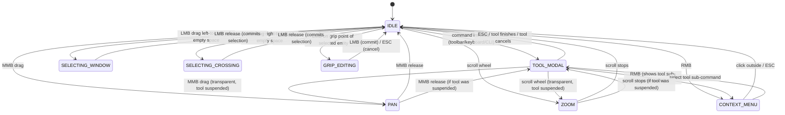

# 33 — UI Interaction Architecture

**Status:** Binding reference
**Scope:** Every input event, tool lifecycle, selection action, and command dispatch in NEXUS
**Rule:** Read this document before touching any code in `packages/app/src/lib/shell/`, `packages/app/src/lib/components/`, or any `ToolHandler` implementation.

---

## 1. Problem Statement

NEXUS's interaction layer has 13 documented bugs that share a single root cause: **no unified input state machine with formal dispatch priority**. Symptoms include:

1. `C` during LINE triggers Circle instead of Close
2. `R` during ARRAY triggers Redo instead of Rectangular
3. Drag box selection reports count but doesn't commit to selection state
4. Delete after drag select deletes 0 entities
5. Escape doesn't reset command line
6. Ctrl+A select all not working
7. Layer visibility toggle not wired to renderer
8. Properties panel geometry values are read-only
9. Extend tool doesn't work
10. Arc tool shows circle preview
11. Status toggles (OSNAP, SNAP, ORTHO) default to OFF
12. Auto-focus command line intercepts tool sub-commands
13. Move tool repeats "Specify base point" without progress

Bugs #1, #2, and #12 are the same class: **no dispatch priority between tool sub-commands and global commands**. Bugs #3, #4, #13 are the same class: **selection state not flowing through to tool operations**. The remaining are isolated wiring gaps.

This document defines the system that makes these bug classes structurally impossible.

---

## 2. How the Reference Applications Solve It

### 2.1 LibreCAD — Status-Integer State Machine

Every tool (called "action") inherits `RS_ActionInterface` which owns a single `int m_status` field. Each tool defines its own status enum (e.g., `SetStartpoint = 0`, `SetEndpoint = 1`). Negative status means finished.

**Event flow:**
```
Qt widget event → QG_GraphicView → LC_EventHandler → RS_ActionInterface virtual dispatch
```

**Two-pass command dispatch** (`qg_actionhandler.cpp:180-206`):
1. Fire `RS_CommandEvent` to the running action. If the action accepts it, done.
2. If not accepted, look up `RS_COMMANDS->cmdToAction(cmd)` to start a new action.

This is why typing `C` during polyline triggers Close (the action accepts it) but typing `C` in idle triggers Circle (no action to accept, falls through to registry).

**Sub-commands:** Each tool overrides `doProcessCommand(status, cmd)` and returns true/false for acceptance. `getAvailableCommands()` returns the context-sensitive list for tab-completion and prompt display.

**Right-click:** Intercepted at the view level before reaching the action. Calls `back()` which triggers `initPrevious(status)` = `init(status - 1)`. At status 0, this calls `init(-1)` which finishes the action.

**Preview:** `RS_PreviewActionInterface` owns a separate `RS_Preview` container. On every `mouseMoveEvent`: `deletePreview()` → action draws new preview → `drawPreview()`. Preview geometry never enters the document — it exists only in the overlay layer.

**Snap:** `RS_ActionInterface` inherits from `RS_Snapper`. Every action IS a snapper. The snap pipeline runs in `toLCMouseMoveEvent()` at the top of every mouse handler, producing an enriched `LC_MouseEvent{snapPoint, graphPoint, modifiers}`.

**Ref:** `librecad/src/lib/actions/rs_actioninterface.cpp:307-313` (setStatus), `rs_actiondrawline.cpp` (LINE tool), `rs_commands.cpp` (registry).

### 2.2 Blender — Operator Lifecycle with exec/invoke/modal

Every operation is an "operator" with five optional callbacks:

| Callback | Has event? | Purpose |
|----------|-----------|---------|
| `poll` | No | Can this op run in current context? |
| `exec` | No | Non-interactive execution (scripts, redo, **AI agents**) |
| `invoke` | Yes | Interactive setup — show popup or go modal |
| `modal` | Yes (every event) | Continuous interaction until FINISHED/CANCELLED |
| `cancel` | No | External abort (undo while modal) |

**Return values are bit flags:**

| Flag | Meaning |
|------|---------|
| `RUNNING_MODAL` | Stay alive, consume event |
| `FINISHED` | Success, push undo step, remove handler |
| `CANCELLED` | Abort, remove handler, no undo |
| `PASS_THROUGH` | Let event fall through to next handler |

The critical combination: `RUNNING_MODAL | PASS_THROUGH` means "I'm still active but I don't care about this event — let viewport navigation handle it." This is how zooming works mid-draw.

**Handler priority stack** (`wm_event_do_handlers`, line 4210):
1. Modal handlers (active tools) — see all events first
2. Area/region keymap handlers (normal tools)
3. Area handlers
4. Window-level handlers (global shortcuts)

Modal operators are LIFO — the most recently activated gets events first. `OPTYPE_MODAL_PRIORITY` operators (navigation) stay at the front.

**Modal keymaps:** Each operator can declare a keymap active only while it runs. Transform maps `ESC` → `TFM_MODAL_CANCEL`, `X` → `TFM_MODAL_AXIS_X`. These bindings exist only during the modal, never conflict with global shortcuts.

**The exec/invoke split IS the AI boundary.** `exec` receives a property bag, no GUI context needed. AI agents call `exec` directly. Humans trigger `invoke` which sets up the interactive modal. Same operator, same undo step, same result.

**Ref:** `wm_event_system.cc:1690-1704` (invoke/exec dispatch), `wm_event_system.cc:2661-2682` (modal call), `transform_ops.cc:539` (invoke), `transform_ops.cc:412` (modal).

### 2.3 FreeCAD — DrawSketchHandler with Selection Gates

FreeCAD's Sketcher uses `DrawSketchHandler` as the tool base class with three pure virtuals: `mouseMove(SnapHandle)`, `pressButton(Vector2d)`, `releaseButton(Vector2d)`.

**Selection gates:** `SelectionFilterGate` implements `allow(doc, obj, subelement)`. During a tool, only matching entities are selectable. Installed via `Gui::Selection().addSelectionGate(gate)`, removed in `quit()`. The Sketcher also disables constraint selectability during tool operation and restores it on deactivate.

**Auto-constraint inference:** On every `mouseMove`, handlers call `seekAndRenderAutoConstraint()` which runs three seekers: preselection (Coincident/PointOnObject/Tangent), alignment (H/V within 2deg), and tangency. On commit, `createAutoConstraints()` opens its own sub-transaction and emits constraint commands.

**Transaction-based undo:** `openCommand(name)` opens an undo transaction. Geometry is added. `commitCommand()` closes it. Mid-tool undo calls `abortCommand()` on the last transaction — reverting the most recent committed geometry while staying in the tool. This is how `U` during LINE undoes the last segment without exiting.

**Attorney pattern:** All handler-to-viewprovider calls go through a friend class intermediary. Derived handlers cannot directly access the view provider — only the base class can. This enforces a single coupling point.

**Ref:** `DrawSketchHandler.h/cpp` (lifecycle), `SelectionFilter.h` (gate DSL), `Command.h` (framework).

---

## 3. The NEXUS Design

### 3.1 Input State Machine

NEXUS uses a layered state machine with two orthogonal axes: **interaction mode** and **tool session state**.

#### Interaction Modes

```
IDLE ─────────────────────── No tool active, no selection in progress
TOOL_MODAL ──────────────── A tool is active, consuming events
SELECTING_WINDOW ────────── Drag-select in progress (left-to-right)
SELECTING_CROSSING ──────── Drag-select in progress (right-to-left)
GRIP_EDITING ────────────── Editing a grip point on selected entity
CONTEXT_MENU ────────────── Context menu is open
PAN ─────────────────────── Middle-mouse pan in progress
ZOOM ────────────────────── Scroll zoom or zoom window in progress
```

#### State Transitions



PAN and ZOOM are **transparent** — they do not cancel the active tool. The tool session is suspended, the view operation executes, and the tool resumes. This matches Blender's `PASS_THROUGH` semantics and LibreCAD's transparent command pattern.

### 3.2 Tool Lifecycle — The exec/invoke/modal Pattern

Every command in NEXUS has two entry points, following Blender's operator model:

```typescript
interface CommandDef {
  id: string;                          // "draw_line"
  label: string;                       // "Line"
  icon?: string;
  aliases: string[];                   // ["l", "line", "li"]
  category: string;                    // "draw" | "modify" | "view" | ...
  shortcut?: string;                   // "L"

  // Non-interactive path — AI agents, scripts, CLI with full params
  execute(params: Record<string, unknown>): CommandResult;

  // Interactive path — returns a modal tool handler
  invoke?(ctx: ToolContext): ToolHandler;

  // MCP tool schema — JSON Schema for execute() params
  schema: JSONSchema;

  undoable: boolean;
}
```

**`execute(params)`** is the agent-callable path. It receives a complete parameter bag, creates a kernel command, and returns a result. No GUI context, no events, no modal loop. This is what MCP tool calls dispatch to.

**`invoke(ctx)`** is the interactive path. It returns a `ToolHandler` that enters the modal loop. The handler receives events until it finishes or cancels.

Both paths produce identical kernel commands and identical undo events. This satisfies Rule 1 (every operation is a command) and Rule 6 (AI agents are first-class users).

### 3.3 ToolHandler — The Modal State Machine

```typescript
// Return values — bit flags, matching Blender's operator status
const RUNNING_MODAL = 1;   // tool stays active, event consumed
const FINISHED      = 2;   // tool done, push undo, remove handler
const CANCELLED     = 4;   // tool aborted, no undo, remove handler
const PASS_THROUGH  = 8;   // event falls through to next handler

type ToolStatus = number;  // combination of the above flags

interface ToolHandler {
  // Lifecycle
  activate(ctx: ToolContext): void;
  deactivate(): void;

  // Event handlers — return status flags
  onPointerDown(event: CanvasPointerEvent): ToolStatus;
  onPointerMove(event: CanvasPointerEvent): ToolStatus;
  onPointerUp(event: CanvasPointerEvent): ToolStatus;
  onCoordinateInput(point: Vec2): ToolStatus;
  onCommandInput(cmd: string): ToolStatus;
  onKeyDown(event: KeyboardEvent): ToolStatus;

  // UI feedback — called by the shell after each event
  getPrompt(): string;                        // "Specify next point or [Close/Undo]:"
  getMouseHints(): { left: string; right: string };  // "Next point" / "Done"
  getAvailableCommands(): SubCommand[];       // [{display: "Close", match: ["c", "close"]}]
  getPreviewGeometry(): PreviewEntity[];      // rubber-band lines, arcs, etc.

  // State
  readonly status: number;                    // current step (0, 1, 2, ...)
  readonly statusLabel: string;               // human-readable current step
}
```

Each tool defines its own status enum:

```typescript
// Example: LineHandler
const enum LineStatus {
  SetStartpoint = 0,
  SetEndpoint = 1,
}
```

**Status progression follows LibreCAD:** `setStatus(n)` updates the status, calls `updatePrompt()` and `updateMouseHints()`. Negative status or returning `FINISHED`/`CANCELLED` terminates the handler.

### 3.4 ToolContext — What Tools Can Access

```typescript
interface ToolContext {
  // Command execution — the ONLY way to modify state
  executeCommand(cmd: KernelCommand): CommandResult;

  // Selection
  getSelectedIds(): EntityId[];
  installSelectionGate(gate: SelectionGate): void;
  removeSelectionGate(): void;

  // System variables
  getSysvar(name: string): unknown;
  setSysvar(name: string, value: unknown): void;

  // Preview (typed, not any)
  preview: PreviewPort;

  // Snap
  snap(screenPoint: Vec2): SnapResult;

  // Coordinate display
  setRelativeOrigin(point: Vec2): void;

  // Undo within tool session
  openTransaction(label: string): TransactionId;
  commitTransaction(id: TransactionId): void;
  abortTransaction(id: TransactionId): void;
}
```

**Key change from current code:** `preview` is typed via `PreviewPort`, not `any`. Selection gates are explicitly installed/removed by tools. Transaction-based undo enables mid-tool `U` that rolls back committed geometry.

### 3.5 PreviewPort — Typed Preview Interface

```typescript
interface PreviewPort {
  setLine(from: Vec2, to: Vec2): void;
  setArc(center: Vec2, radius: number, startAngle: number, endAngle: number): void;
  setCircle(center: Vec2, radius: number): void;
  setPolyline(points: Vec2[]): void;
  setRect(corner1: Vec2, corner2: Vec2): void;
  setEntities(entities: PreviewEntity[]): void;  // for complex previews (array, mirror)
  setGhost(entities: PreviewEntity[]): void;      // AI suggestion overlay (dimmed)
  setReferencePoint(point: Vec2): void;           // highlighted control point
  setReferenceLines(lines: [Vec2, Vec2][]): void; // construction lines
  clear(): void;
}
```

Preview geometry is **ephemeral** — cleared and redrawn on every `onPointerMove`. It never enters the document or event store. The renderer maintains a separate overlay layer for preview, matching LibreCAD's `RS_Preview` container pattern.

---

## 4. Command Dispatch Priority

When an input event arrives, the `InteractionShell` resolves it through this priority chain. **The first handler that accepts the event wins — no further processing.**

```
1. MODAL DIALOG        → Is a modal dialog open? Feed to dialog.
2. CONTEXT MENU        → Is context menu open? Feed to menu.
3. ACTIVE TOOL         → Is a tool in TOOL_MODAL mode?
   3a. Tool modal key  → Does the tool's modal keymap claim this key? Feed to tool.
   3b. Tool coordinate → Is this a pointer event? Snap + feed to tool.
   3c. Tool command    → Is this typed text? Try tool's onCommandInput().
                         If tool returns PASS_THROUGH, continue to step 4.
4. TRANSPARENT CMD     → Is it a transparent command (zoom, pan, snap override)?
                         Execute without canceling tool. Tool stays suspended.
5. ESCAPE              → Cancel active tool, clear selection, reset command line.
6. GLOBAL SHORTCUT     → Ctrl+Z, Ctrl+S, Ctrl+A, function keys, etc.
7. COMMAND ALIAS       → Look up in CommandRegistry by name/alias.
                         If found: cancel active tool, invoke new command.
8. COORDINATE PARSE    → Try parsing as coordinates (x,y or @dx,dy or d<angle).
                         If tool active, feed as onCoordinateInput().
9. IDLE SELECTION      → Single click: entity pick. Drag: window/crossing select.
10. UNHANDLED          → Show "Unknown command: ..." in command line history.
```

**This solves bugs #1 and #2:** When a tool is active, step 3c tries the tool first. The LINE tool's `onCommandInput("c")` matches its "Close" sub-command and returns `RUNNING_MODAL` (accepted). The event never reaches step 7 where "C" would resolve to Circle. Only if the tool returns `PASS_THROUGH` does the input fall through.

**This solves bug #12:** Auto-focus command line no longer intercepts tool sub-commands. The shell routes input through the priority chain, not through the DOM focus system. Typed text goes to the shell, which tries the active tool first (step 3c) before falling through to command lookup (step 7).

### 4.1 Transparent Commands

Transparent commands execute without canceling the active tool. They are identified by a `transparent: true` flag on the `CommandDef`.

Built-in transparent commands:
- `'zoom` / scroll wheel — zoom
- `'pan` / MMB drag — pan
- F3 — toggle OSNAP
- F7 — toggle grid
- F8 — toggle ortho

During transparent execution, the tool session is **suspended** (not canceled). After the transparent command completes, the tool resumes at its previous status.

---

## 5. Selection Model

### 5.1 Selection Store

```typescript
interface SelectionStore {
  // State
  selected: Map<EntityId, SelectionEntry>;
  preselected: EntityId | null;        // hover highlight (visual only)
  gate: SelectionGate | null;          // active filter

  // Mutations
  select(id: EntityId): void;
  deselect(id: EntityId): void;
  toggle(id: EntityId): void;          // Ctrl+click
  selectAll(): void;                   // Ctrl+A
  deselectAll(): void;                 // Escape in IDLE
  selectWindow(rect: Rect): void;      // entities fully inside
  selectCrossing(rect: Rect): void;    // entities touching

  // Gate
  installGate(gate: SelectionGate): void;
  removeGate(): void;

  // Query
  has(id: EntityId): boolean;
  count(): number;
  ids(): EntityId[];
}

interface SelectionGate {
  canSelect(entityId: EntityId): boolean;
  reason: string;  // shown in status bar: "Select entity to trim"
}

interface SelectionEntry {
  entityId: EntityId;
  timestamp: number;
}
```

### 5.2 Selection Modes

**Single click on entity:** Hit-test at pointer position. If gate is installed, check `gate.canSelect(id)`. If pass, toggle or replace selection based on Ctrl modifier.

**Single click on empty space:** Deselect all (unless tool is active).

**Drag select — direction determines mode** (LibreCAD pattern):
- **Left-to-right drag** = window select: only entities **fully contained** within the rectangle are selected. Visual: solid blue rectangle.
- **Right-to-left drag** = crossing select: entities **touching or inside** the rectangle are selected. Visual: dashed green rectangle.

This matches AutoCAD behavior exactly and requires no mode toggle button.

**Ctrl+click:** Toggle entity in/out of selection set.

**Ctrl+A:** Select all visible, unlocked entities.

**Escape in IDLE:** Deselect all. (Escape during TOOL_MODAL cancels the tool first.)

### 5.3 Pre-selection (Hover Highlight)

On pointer move in IDLE mode, hit-test the nearest entity. If found:
- Set `preselected = entityId`
- Renderer shows highlight (e.g., thicker stroke, contrasting color)
- Status bar shows entity type and layer

Pre-selection is **visual feedback only** — it does not affect the selection set. Clicking promotes pre-selection to selection.

### 5.4 Selection Gates During Tools

When a tool activates that requires entity selection (Trim, Extend, Fillet, Move with no pre-selection), it installs a `SelectionGate` that restricts pickable entities:

```typescript
// TrimHandler.activate()
ctx.installSelectionGate({
  canSelect: (id) => {
    const entity = ctx.getEntity(id);
    return entity.type === 'line' || entity.type === 'arc' || entity.type === 'circle';
  },
  reason: "Select cutting edge"
});
```

The gate is removed in `deactivate()`. While a gate is active, entities that fail the gate are not highlighted on hover and clicks on them are ignored.

**This solves bugs #3 and #4:** Selection commits to the store immediately, and tools read from the store. The drag-select commits via `selectWindow()`/`selectCrossing()` which updates `selected` — the same map that `Delete` reads from.

---

## 6. Context Menu Model

The context menu contents are determined by the current interaction mode and selection state:

### IDLE, nothing selected:
```
Repeat Last Command    Enter
─────────────────────
Undo                   Ctrl+Z
Redo                   Ctrl+Y
─────────────────────
Paste                  Ctrl+V
Select All             Ctrl+A
─────────────────────
Zoom Extents           Z,E
Zoom Window            Z,W
```

### IDLE, entities selected:
```
Move                   M
Copy                   CO
Rotate                 RO
Mirror                 MI
Scale                  SC
─────────────────────
Delete                 Del
─────────────────────
Properties...
─────────────────────
Repeat Last Command    Enter
Undo                   Ctrl+Z
Redo                   Ctrl+Y
─────────────────────
Deselect All           Escape
```

### TOOL_MODAL (tool sub-commands):
```
[Dynamic: tool's getAvailableCommands()]
   e.g., Close          C
         Undo           U
         Arc mode       A
─────────────────────
Cancel                  Escape
```

### GRIP_EDITING:
```
Stretch
Move to...
─────────────────────
Cancel                  Escape
```

Context menu items are `CommandDef` references — clicking one dispatches through the same command system as toolbar clicks or keyboard shortcuts.

---

## 7. Prompt and Feedback Model

### 7.1 Dynamic Prompt

The command line prompt updates on every state change:

```
Command:                                    ← IDLE, no tool
Specify first point:                        ← LINE status 0
Specify next point or [Close/Undo]:         ← LINE status 1, 2+ points
Specify next point or [Undo]:               ← LINE status 1, 1 point
Select objects to move (3 selected):        ← MOVE status 0
Specify base point:                         ← MOVE status 1
Specify displacement or <use first point>:  ← MOVE status 2
```

The prompt is generated by `ToolHandler.getPrompt()`. Bracket options (`[Close/Undo]`) are auto-generated from `getAvailableCommands()` — each sub-command's `display` field is joined with `/` and wrapped in brackets.

### 7.2 Command Echo

Every completed action echoes to the command history:

```
Command: LINE
Specify first point: 100,200
Specify next point: 300,400
Specify next point: *Cancel*
```

Coordinate inputs echo the resolved coordinates. Sub-commands echo in italics. Cancellation echoes `*Cancel*`.

### 7.3 Mouse Hints

Updated by `ToolHandler.getMouseHints()` on every state change:

| State | LMB | RMB |
|-------|-----|-----|
| IDLE, nothing | Select entity | Context menu |
| IDLE, hover | Select entity | Context menu |
| LINE status 0 | First point | Cancel |
| LINE status 1 | Next point | Done / back |
| MOVE status 0 | Select entities | Done selecting |
| MOVE status 1 | Base point | Cancel |

### 7.4 Coordinate Display

Always visible in the status bar, updated on every pointer move:

```
X: 1234.567  Y: 890.123  |  dX: 34.567  dY: -10.877  |  Dist: 36.236  Angle: 342.5°
```

- **Absolute:** current pointer position in world coordinates
- **Relative:** delta from the last confirmed point (set via `ctx.setRelativeOrigin()`)
- **Polar:** distance and angle from relative origin

### 7.5 Status Bar Layout

Left to right:
```
[Mouse hints: LMB/RMB] | [Coordinates] | [SNAP] [GRID] [ORTHO] | [Layer: 0] | [Selection: 3 entities]
```

Toggle buttons (SNAP, GRID, ORTHO) are both clickable and bound to function keys (F3, F7, F8).

---

## 8. Keyboard Model

### 8.1 Layered Keymap

Three layers, most specific wins (Blender's modal keymap pattern):

**Layer 1 — Tool modal keymap** (only active during TOOL_MODAL):
```
ESC     → cancel tool
Enter   → finish/confirm
U       → tool-specific undo (e.g., undo last polyline segment)
C       → Close (if tool exposes it)
A       → Arc mode (if tool exposes it)
```
These are defined by the tool via `getAvailableCommands()` — each sub-command specifies its `match` keys. The shell checks this layer first.

**Layer 2 — Global shortcuts** (always active unless consumed by Layer 1):
```
Ctrl+Z  → Undo
Ctrl+Y  → Redo
Ctrl+S  → Save
Ctrl+A  → Select All
Ctrl+C  → Copy
Ctrl+V  → Paste
Del     → Delete selected
F3      → Toggle OSNAP
F7      → Toggle Grid
F8      → Toggle Ortho
```

**Layer 3 — Command aliases** (only when no tool is active or tool passes through):
```
L       → Line
C       → Circle
A       → Arc
M       → Move
CO      → Copy
RO      → Rotate
...
```

### 8.2 Key Resolution Algorithm

```
1. Is input focused on a dialog/form field? → feed to DOM element, stop.
2. Is a tool active?
   2a. Does the tool's modal keymap match? → feed to tool, stop.
   2b. Tool doesn't match → continue.
3. Is it a modified key (Ctrl/Alt/Meta + key)? → check global shortcuts, stop if match.
4. Is it a function key? → check global shortcuts, stop if match.
5. Is it a single letter/number? →
   5a. If tool active, treat as command input → try tool.onCommandInput(), 
       if PASS_THROUGH, try command alias lookup.
   5b. If no tool, try command alias lookup.
6. No match → redirect to command line input field for accumulation.
```

**This solves bug #1:** `C` during LINE hits step 2a — the LINE tool's modal keymap includes `{match: ["c", "close"], action: close}`. It never reaches step 5b where `C` resolves to Circle.

### 8.3 Auto-Focus Behavior

Typing does NOT auto-focus the command line input element. Instead:

- All keyboard events go to the `InteractionShell` first
- The shell routes through the priority chain (section 4)
- Only unmatched text accumulates in the command line
- The command line displays accumulated text but does not own focus

This is a global keydown listener on the canvas container, not DOM focus management. It matches LibreCAD's approach where `QG_GraphicView::keyPressEvent` handles routing before the command widget sees anything.

### 8.4 Extensibility for Workbenches

Each workbench registers its own keymap layer:

```typescript
interface WorkbenchKeymap {
  workbenchId: string;           // "cad2d" | "bim" | "gis"
  toolAliases: Map<string, string>;   // key → commandId
  shortcuts: Map<string, string>;     // key combo → commandId
}
```

When switching workbenches, the active keymap layer swaps. BIM can map `W` to `Wall` without conflicting with 2D CAD's keybindings.

---

## 9. Undo Model

### 9.1 Command-Level Undo (Ctrl+Z)

Every `executeCommand()` call that modifies state produces an event in the kernel's event store. `Ctrl+Z` moves the event cursor back one step. `Ctrl+Y` moves it forward. This is the existing kernel design — no changes needed.

### 9.2 Within-Tool Undo (U Key)

For multi-step tools (LINE chain, POLYLINE), pressing `U` must undo the **last committed segment** without leaving the tool.

**Current problem:** `LineHandler` pops from a local `points` array but doesn't roll back the kernel-committed geometry. The kernel has already emitted a `CreateLine` event.

**Solution — transaction-based undo (FreeCAD pattern):**

Each step within a tool session opens a transaction:

```typescript
// LineHandler.onCoordinateInput() — status SetEndpoint
const txn = ctx.openTransaction("Line segment");
ctx.executeCommand({ type: 'CreateLine', from: this.lastPoint, to: point });
ctx.commitTransaction(txn);
this.transactions.push(txn);
this.lastPoint = point;
```

When `U` is pressed during the tool:
```typescript
// LineHandler.onCommandInput("u")
const txn = this.transactions.pop();
if (txn) {
  ctx.abortTransaction(txn);  // rolls back the CreateLine event
  this.lastPoint = this.points[this.points.length - 1];
}
```

`abortTransaction` rewinds the event store cursor past the events in that transaction. When the tool finishes or cancels, any open transactions are committed or aborted as a group.

### 9.3 Undo Groups

A multi-step operation that should undo atomically (e.g., ARRAY creating 20 entities) wraps all commands in a single transaction:

```typescript
const txn = ctx.openTransaction("Array 4x5");
for (const offset of offsets) {
  ctx.executeCommand({ type: 'CopyEntity', id: entity.id, offset });
}
ctx.commitTransaction(txn);
```

`Ctrl+Z` reverts the entire array as one step.

### 9.4 Transaction Implementation

Transactions map to ranges in the event store:

```typescript
interface Transaction {
  id: TransactionId;
  label: string;
  startIndex: number;   // event store index when opened
  endIndex?: number;     // set on commit
}
```

`abortTransaction()` sets the event cursor to `startIndex`, effectively undoing all events in the transaction. The events are not deleted — they remain in the store for redo. This is consistent with Rule 2 (event-sourced state, never delete events).

---

## 10. Responsiveness and Adaptation

### 10.1 Toolbar Adaptation

The toolbar uses a priority-based overflow system:

1. Each toolbar group has a `priority: number` (lower = more important)
2. At full width, all groups are visible
3. As viewport narrows, lowest-priority groups collapse first into a `>>` overflow menu
4. At minimum width, only the highest-priority group remains + overflow

Groups for 2D CAD (in priority order): Draw, Modify, View, Snap, Layer.

### 10.2 Context Menu Positioning

Context menus position at the pointer with edge detection:
- If menu would overflow right edge → flip to left of pointer
- If menu would overflow bottom → flip above pointer
- Submenu cascades respect the same edge logic

### 10.3 Touch Input (Future)

Touch mappings for tablet/mobile support:

| Touch gesture | Maps to |
|--------------|---------|
| Tap | LMB click |
| Long press | RMB click (context menu) |
| Two-finger pinch | Zoom |
| Two-finger drag | Pan |
| Double-tap | Zoom extents |

### 10.4 Command Line on Mobile

On narrow viewports, the command line becomes a slide-up panel triggered by a floating button. It auto-dismisses after command execution. The prompt text and sub-command buttons remain visible during tool operation.

---

## 11. Domain Extensibility

### 11.1 How a BIM Workbench Adds Tools

A BIM domain adds tools by:

1. **Registering commands** — new `CommandDef` entries in the `CommandRegistry`:
   ```typescript
   registry.register({
     id: 'draw_wall',
     label: 'Wall',
     aliases: ['wall', 'wa'],
     category: 'bim:draw',
     execute: (params) => { /* create wall geometry via kernel */ },
     invoke: (ctx) => new WallHandler(ctx),
     schema: { type: 'object', properties: { start: ..., end: ..., thickness: ... } },
     undoable: true,
   });
   ```

2. **Implementing tool handlers** — `WallHandler` extends the same `ToolHandler` interface. It has its own status enum, sub-commands, preview geometry, and selection gates. **No changes to the state machine.**

3. **Declaring a workbench** — the BIM workbench defines its toolbars, keymap, and panels:
   ```typescript
   const bimWorkbench: Workbench = {
     id: 'bim',
     label: 'BIM',
     toolbars: [
       { id: 'bim:draw', commands: ['draw_wall', 'draw_column', 'draw_slab'] },
       { id: 'bim:modify', commands: ['split_wall', 'join_walls'] },
     ],
     keymap: {
       toolAliases: new Map([['W', 'draw_wall'], ['CO', 'draw_column']]),
       shortcuts: new Map(),
     },
     panels: ['properties', 'layers', 'bim_browser'],
     defaultTool: null,
   };
   ```

4. **Adding ECS components** — `BIMProperties`, `WallData`, etc. as new components. No changes to existing components.

### 11.2 How a GIS Workbench Adds Context Menu Items

Context menu items are generated from the command registry filtered by `category` and the current selection:

```typescript
// ContextMenuBuilder
function getModifyCommands(selected: EntityId[]): CommandDef[] {
  return registry.getByCategory('modify')
    .concat(registry.getByCategory(`${activeWorkbench}:modify`))
    .filter(cmd => cmd.poll?.(selected) !== false);
}
```

GIS commands with `category: 'gis:modify'` appear only when the GIS workbench is active. The `poll()` function (Blender pattern) determines if the command is valid for the current selection.

### 11.3 How a Civil Workbench Adds Sub-Commands

A Civil alignment tool with domain-specific sub-commands:

```typescript
class AlignmentHandler implements ToolHandler {
  getAvailableCommands(): SubCommand[] {
    switch (this.status) {
      case 0: return [];  // selecting start point
      case 1: return [
        { display: 'Line', match: ['l', 'line'] },
        { display: 'Curve', match: ['c', 'curve'] },
        { display: 'Spiral', match: ['s', 'spiral'] },
        { display: 'Undo', match: ['u', 'undo'] },
        { display: 'Close', match: ['cl', 'close'] },
      ];
    }
  }
}
```

The state machine doesn't know about "Spiral" or "Curve" — it just routes text to the tool's `onCommandInput()` which matches against `getAvailableCommands()`. Zero changes to the interaction architecture.

### 11.4 Workbench Registration Pattern

```typescript
interface Workbench {
  id: string;
  label: string;
  toolbars: ToolbarGroup[];
  keymap: WorkbenchKeymap;
  panels: string[];
  defaultTool: string | null;
}

interface WorkbenchRegistry {
  register(workbench: Workbench): void;
  activate(id: string): void;
  getActive(): Workbench;
}
```

Switching workbenches:
1. `registry.activate('bim')`
2. Active workbench store updates
3. Svelte reactivity re-renders toolbars from new command ID arrays
4. Keymap layer swaps
5. Panel visibility updates
6. Any active tool is canceled

This is a data-driven swap — no component tree changes, no conditional rendering based on workbench type.

---

## 12. How the 13 Bugs Are Resolved

| # | Bug | Root cause | Resolution |
|---|-----|-----------|------------|
| 1 | `C` during LINE triggers Circle | No dispatch priority between tool sub-commands and global aliases | Section 4, step 3c: tool's `onCommandInput` is tried first. LINE accepts `C` as Close. Event never reaches alias lookup. |
| 2 | `R` during ARRAY triggers Redo | Same as #1 | Same fix. ARRAY accepts `R` as Rectangular before global shortcuts are checked. |
| 3 | Drag select reports count but doesn't commit | Selection drag didn't call `selectWindow()`/`selectCrossing()` on the store | Section 5.2: drag select completes by calling `store.selectWindow(rect)` or `store.selectCrossing(rect)` which updates the `selected` map. |
| 4 | Delete after drag select deletes 0 | Selection not committed to store (consequence of #3) | Same fix as #3. Delete reads from `store.ids()` which now contains the drag-selected entities. |
| 5 | Escape doesn't reset command line | Command line holds state independently of interaction mode | Section 4, step 5: Escape triggers `cancelActiveTool()` + `deselectAll()` + `clearCommandInput()`. The command line is cleared as part of the escape handler, not as a side effect. |
| 6 | Ctrl+A not working | Key not wired | Section 8.2, Layer 2 global shortcuts: `Ctrl+A → selectAll()`. |
| 7 | Layer visibility not wired to renderer | Observer gap (not an interaction architecture issue) | Outside scope — fixed in S3-observer-wiring task. The interaction architecture ensures layer changes go through `executeCommand()` which emits events the renderer subscribes to. |
| 8 | Properties panel read-only | No edit-back path from panel to kernel | Outside scope — requires property panel to dispatch `ModifyEntity` commands through `executeCommand()`. The interaction architecture provides the `CommandDef.execute()` path. |
| 9 | Extend tool doesn't work | Missing implementation + no selection gate | Section 5.4: ExtendHandler installs a `SelectionGate` restricting picks to extendable entity types. Tool lifecycle (activate → gate → pick → execute → deactivate) follows the standard pattern. |
| 10 | Arc tool shows circle preview | Preview type mismatch | Section 3.5: `PreviewPort.setArc()` takes explicit `startAngle` and `endAngle` parameters. Cannot accidentally show a full circle when an arc is intended. |
| 11 | Status toggles default to OFF | Sysvar initialization gap | Section 7.5: OSNAP, GRID, ORTHO are sysvars initialized to sensible defaults (OSNAP: ON with Endpoint+Midpoint+Center, GRID: ON, ORTHO: OFF). Status bar reads from sysvars via `$derived`. |
| 12 | Auto-focus intercepts tool sub-commands | Command line input steals keyboard events from tool dispatch | Section 8.3: typing does NOT auto-focus the command line. All keyboard events go to InteractionShell first. Only unmatched text accumulates in the command line display. |
| 13 | Move tool repeats base point prompt | Tool doesn't advance status after receiving coordinate | Section 3.3: `onCoordinateInput` returns `RUNNING_MODAL` and advances `this.status` to the next step. If the tool doesn't advance, it's a handler bug visible in the status enum — the pattern makes it impossible to silently stay at the same status because the prompt changes per status via `getPrompt()`. |

---

## 13. Migration Plan — From Current Code to This Design

The current codebase already has many of these patterns partially implemented. The migration is incremental — each step leaves the app compilable and functional.

### Phase 1: Typed Interfaces (1 day)

1. Define `ToolStatus` flags (`RUNNING_MODAL`, `FINISHED`, `CANCELLED`, `PASS_THROUGH`)
2. Update `ToolHandler` interface to return `ToolStatus` from all event handlers
3. Define `PreviewPort` interface
4. Define `SubCommand` type for `getAvailableCommands()`
5. Update `ToolContext` to include `installSelectionGate()`, `removeSelectionGate()`, `openTransaction()`, `commitTransaction()`, `abortTransaction()`

No behavior change — just type definitions. All existing handlers continue to work with adapters.

### Phase 2: Dispatch Priority (1 day)

1. Refactor `InteractionShell.handleInput()` to follow the 10-step priority chain (section 4)
2. Add tool modal keymap check (step 3a) before global shortcuts
3. Move keyboard routing from DOM focus to global event listener (section 8.3)
4. Add command line accumulation for unmatched text

This fixes bugs #1, #2, #5, #12.

### Phase 3: Selection Hardening (1 day)

1. Ensure drag-select commits to `SelectionStore` via `selectWindow()`/`selectCrossing()`
2. Implement direction-based mode detection (left-to-right = window, right-to-left = crossing)
3. Wire Ctrl+A, Escape deselect, Ctrl+click toggle
4. Add pre-selection (hover highlight) in IDLE mode

This fixes bugs #3, #4, #6.

### Phase 4: Tool Handler Migration (2-3 days)

1. Update each tool handler to:
   - Return `ToolStatus` flags from event handlers
   - Use `PreviewPort` instead of `ctx.renderer?.setPreview()`
   - Install/remove selection gates in activate/deactivate
   - Use transactions for multi-step undo
   - Implement `getPrompt()`, `getMouseHints()`, `getAvailableCommands()`
2. Define status enums per tool (replace raw integers)

This fixes bugs #9, #10, #13.

### Phase 5: Feedback UI (1 day)

1. Wire status bar: mouse hints, coordinates, toggles, layer, selection count
2. Wire command line: dynamic prompt, echo, history, bracket options
3. Initialize sysvars to sensible defaults

This fixes bugs #8, #11.

### Phase 6: Context Menu + Workbench (1 day)

1. Implement context menu builder that reads from CommandRegistry + current state
2. Define the `cad2d` workbench as the default
3. Implement workbench switching (data swap, no component changes)

---

## 14. Appendix: Current NEXUS Strengths to Preserve

The current codebase has several patterns that align with this design and should NOT be rewritten:

1. **InteractionShell input pipeline** — the priority ladder in `handleInput()` is close to the target. It needs reordering, not rewriting.
2. **BaseToolHandler keyword system** — `registerKeyword(status, display, match[], action)` with auto-generated bracket prompts maps directly to `getAvailableCommands()` + `SubCommand`.
3. **Transparent command support** — `handleTransparentCommand()` with suspend/resume already works.
4. **Sysvar persistence** — `ctx.getSysvar/setSysvar` used in FilletHandler for `FILLETRAD` is the correct pattern.
5. **SelectionGate infrastructure** — `SelectionSet.installGate()` exists and works. Tools just need to call it.
6. **Event-sourced command dispatch** — tools call `ctx.executeCommand()` which routes to the kernel. This is correct and complete.
7. **CommandRegistry with aliases** — the registry supports name/alias lookup. It needs `schema` population and `poll()` support, not rewriting.

---

## 15. Appendix: Key Interface Summary

| Interface | Purpose | Defined in |
|-----------|---------|-----------|
| `CommandDef` | Command with `execute` + `invoke` + `schema` | CommandRegistry |
| `ToolHandler` | Modal state machine for interactive tools | InteractionShell |
| `ToolContext` | What tools can access (commands, selection, preview, snap, transactions) | InteractionShell |
| `ToolStatus` | Bit flags: RUNNING_MODAL, FINISHED, CANCELLED, PASS_THROUGH | InteractionShell |
| `PreviewPort` | Typed preview geometry interface | Renderer boundary |
| `SelectionStore` | Selected + preselected + gate | SelectionSet |
| `SelectionGate` | Filter during tool operation | SelectionSet |
| `SubCommand` | Tool-specific command option | ToolHandler |
| `Workbench` | Toolbar + keymap + panel config per domain | WorkbenchRegistry |
| `WorkbenchKeymap` | Domain-scoped key bindings | WorkbenchRegistry |
| `Transaction` | Undo group for multi-step operations | EventStore |
